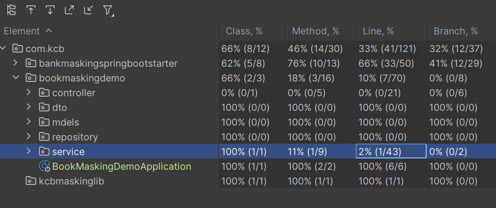

## Masking Library Demo
- Create a Spring Boot application that demonstrates the use of a masking library to protect sensitive data in logs and outputs.
- Used spring boot autoconfiguration to set up the masking library and configured it to mask specific fields such as credit card numbers, social security numbers, and email addresses.
- Implemented the log library using **Strategy** pattern to allow for flexible masking strategies based on the type of data being masked.
- Linked the masking library to the log-back configuration to ensure that all logs containing sensitive data are properly masked before being outputted. This faciliated intercepting of the 
logs and applying the appropriate masking strategy based on the type of data being logged.
- The library has used the 3 strategy defined in the problem statement and for the PARTIAL, it's assuming that the first two and last digits would be shown when set.

## Consumer Service: Book Service Demo
- The service uses Spring Boot to create a RESTful API for managing books, allowing clients to perform CRUD operations on book resources.
- In order to consume the reusable library, the service must override the lob-backs default message converter to use the one defined in the reusable library.
- If the service does not specify the properties, if the library is on classpath, it would automatically enable the log library
- This is done by creating a custom configuration class that extends `WebMvcConfigurer` and overrides the `configureMessageConverters` method to add the custom message converter from the reusable library.

## Running the application
- To run the application, you can use the following command in the home directory, to first compile the library as it is used as dependency in the consuming books service
using the command `mvn clean install` and then run the book service using the command `mvn spring-boot:run` in the book service directory.
- Once the application is running, you can test the API endpoints using tools like Postman, import the collection found at the root directory of this project to test the exposed endpoints

## Tests

To run tests after running the application, you can use the command `mvn test` in the home directory of each module to view the tests cases defined and their pass rate. This will execute all the tests defined in both the masking library and the book service, ensuring that all functionalities are working as expected.
Used the intellij Test Coverage plugin and go the following report
